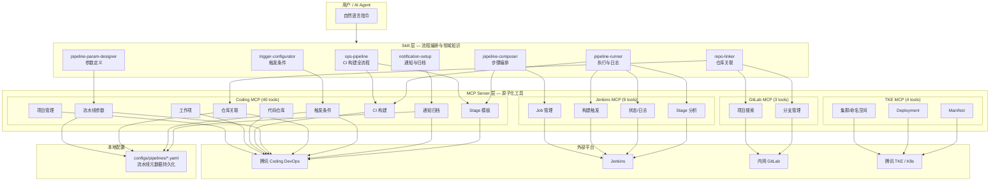
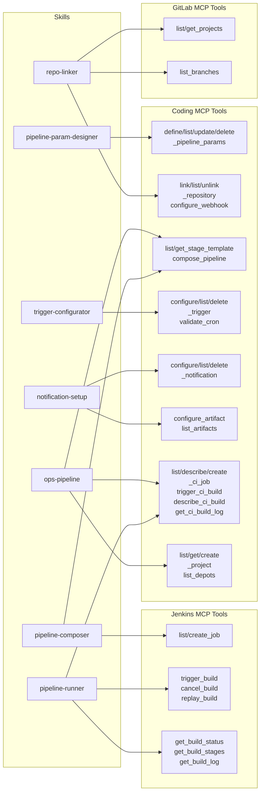

# ops-agent

运维自动化 Agent —— 接收业务上线需求，自动完成 CI/CD 流水线配置、构建部署、网络配置。

基于 [FastMCP](https://github.com/jlowin/fastmcp) 构建 MCP Server，通过标准化 Tool 接口对接 Coding DevOps、Jenkins、GitLab、TKE 等平台。

---

## 系统架构



---

## Skill — MCP 关系矩阵



**Skill 与 MCP 工具对照表：**

| Skill | 调用的 MCP Server | 主要 MCP Tools |
|-------|-------------------|---------------|
| `ops-pipeline` | Coding | `list_projects`, `list_depots`, `list_ci_jobs`, `get_or_create_ci_job`, `trigger_ci_build`, `get_ci_build_log` |
| `pipeline-param-designer` | Coding | `define_pipeline_params`, `list_pipeline_params`, `update_pipeline_param`, `delete_pipeline_param` |
| `repo-linker` | Coding + GitLab | `link_repository`, `list_linked_repos`, `configure_webhook`, `list_depots`, `gitlab.list_projects`, `gitlab.list_branches` |
| `pipeline-composer` | Coding + Jenkins | `list_stage_templates`, `get_stage_template`, `compose_pipeline`, `create_ci_job`, `jenkins.create_job` |
| `trigger-configurator` | Coding | `configure_trigger`, `list_triggers`, `delete_trigger`, `validate_cron_expression` |
| `notification-setup` | Coding | `configure_notification`, `list_notifications`, `configure_artifact`, `list_artifacts_config`, `list_ci_artifacts` |
| `pipeline-runner` | Coding + Jenkins | `trigger_ci_build`, `describe_ci_build`, `get_ci_build_log`, `jenkins.trigger_build`, `jenkins.get_build_status`, `jenkins.get_build_stages`, `jenkins.cancel_build`, `jenkins.replay_build` |

---

## MCP Tool 全量清单

### Coding MCP Server — 40 tools

| 类别 | Tool | 说明 |
|------|------|------|
| **项目管理** | `list_projects` | 查询项目列表（模糊搜索） |
| | `get_project` | 查询项目详情 |
| | `create_project` | 创建项目 |
| | `delete_project` | 删除项目 |
| **工作项** | `list_issues` | 查询工作项列表 |
| | `describe_issue` | 查询工作项详情 |
| | `create_issue` | 创建工作项 |
| | `delete_issue` | 删除工作项 |
| | `decompose_issue` | 需求拆解为子任务 |
| **代码仓库** | `list_depots` | 查询代码仓库列表 |
| | `list_commits` | 查询提交记录 |
| | `create_merge_request` | 创建合并请求 |
| **CI 构建** | `list_ci_jobs` | 查询构建计划列表 |
| | `describe_ci_job` | 获取构建计划详情 |
| | `create_ci_job` | 创建构建计划 |
| | `get_or_create_ci_job` | 幂等创建构建计划 |
| | `trigger_ci_build` | 触发构建 |
| | `list_ci_builds` | 获取构建历史记录 |
| | `describe_ci_build` | 查询构建详情 |
| | `get_ci_build_log` | 获取构建日志 |
| **流水线参数** | `define_pipeline_params` | 定义参数列表 |
| | `list_pipeline_params` | 查询参数列表 |
| | `update_pipeline_param` | 修改单个参数 |
| | `delete_pipeline_param` | 删除参数 |
| **仓库关联** | `link_repository` | 关联仓库到流水线 |
| | `list_linked_repos` | 查询已关联仓库 |
| | `unlink_repository` | 取消仓库关联 |
| | `configure_webhook` | 配置 Webhook 触发 |
| **构建模板** | `list_stage_templates` | 列出可用阶段模板 |
| | `get_stage_template` | 获取模板详情 |
| | `compose_pipeline` | 组合生成 Jenkinsfile |
| **触发条件** | `configure_trigger` | 配置触发规则 |
| | `list_triggers` | 查询触发规则 |
| | `delete_trigger` | 删除触发规则 |
| | `validate_cron_expression` | 校验 cron 表达式 |
| **通知与归档** | `configure_notification` | 配置通知规则 |
| | `list_notifications` | 查询通知规则 |
| | `delete_notification` | 删除通知规则 |
| | `configure_artifact` | 配置制品归档 |
| | `list_artifacts_config` | 查询归档配置 |
| | `list_ci_artifacts` | 查询制品列表 |

### Jenkins MCP Server — 9 tools

| Tool | 说明 |
|------|------|
| `list_jobs` | 列出所有 Job |
| `create_job` | 创建 Pipeline Job |
| `trigger_build` | 触发构建（支持参数） |
| `get_build_status` | 获取构建状态 |
| `get_last_build_number` | 获取最新构建编号 |
| `get_build_log` | 获取构建日志 |
| `cancel_build` | 中止运行中的构建 |
| `replay_build` | 以相同参数重跑构建 |
| `get_build_stages` | 获取各 Stage 状态与耗时 |

### GitLab MCP Server — 3 tools

| Tool | 说明 |
|------|------|
| `list_projects` | 搜索项目（模糊匹配） |
| `get_project` | 获取项目详情 |
| `list_branches` | 列出分支 |

### TKE MCP Server — 4 tools (TODO)

| Tool | 说明 |
|------|------|
| `list_clusters` | 列出 TKE 集群 |
| `list_namespaces` | 列出命名空间 |
| `get_deployments` | 获取 Deployment 列表 |
| `apply_manifest` | 应用 K8s Manifest |

---

## Skill 清单

| Skill | 说明 | 引导流程 |
|-------|------|---------|
| `ops-pipeline` | CI 构建全流程编排 | 确认项目 → 获取凭据 → 生成 Jenkinsfile → 创建计划 → 触发构建 |
| `pipeline-param-designer` | 流水线参数定义 | 收集参数 → 类型映射 → 持久化 → 生成 parameters 块 |
| `repo-linker` | 仓库关联配置 | 选择来源 → 配置认证 → 分支策略 → Webhook |
| `pipeline-composer` | 构建步骤编排 | 选择模板 → 排列顺序 → 并行配置 → 生成 Jenkinsfile |
| `trigger-configurator` | 触发条件配置 | 选择类型 → 填写条件 → 校验 cron → 保存规则 |
| `notification-setup` | 通知与归档配置 | 选择渠道 → 配置 Webhook → 通知条件 → 制品归档 |
| `pipeline-runner` | 流水线执行与日志 | 确认参数 → 触发构建 → 轮询状态 → 输出汇总 |

---

## 项目结构

```
ops-agent/
├── mcp_servers/                  # MCP Server 实现
│   ├── coding/
│   │   ├── server.py             # 40 个 MCP Tool 注册
│   │   ├── api.py                # Coding OpenAPI 客户端
│   │   ├── templates.py          # Jenkinsfile 模板（镜像构建）
│   │   ├── stage_templates.py    # 11 个 Stage 模板 + 组合生成器
│   │   └── pipeline_config.py    # 流水线元数据本地持久化 (YAML)
│   ├── jenkins/
│   │   ├── server.py             # 9 个 MCP Tool 注册
│   │   └── api.py                # Jenkins REST API 客户端
│   ├── gitlab/
│   │   ├── server.py             # 3 个 MCP Tool 注册
│   │   └── api.py                # GitLab REST API 客户端
│   └── tke/
│       └── server.py             # 4 个 MCP Tool（TODO）
├── skills/                       # Agent Skill 定义
│   ├── ops-pipeline/             # CI 构建全流程（含业务线规范）
│   │   ├── SKILL.md
│   │   └── references/           # 业务线差异化配置
│   ├── pipeline-param-designer/  # 参数定义引导
│   ├── repo-linker/              # 仓库关联引导
│   ├── pipeline-composer/        # 步骤编排引导
│   ├── trigger-configurator/     # 触发条件引导
│   ├── notification-setup/       # 通知归档引导
│   └── pipeline-runner/          # 执行与日志引导
├── configs/
│   ├── mcp_registry.yaml         # MCP Server 注册表
│   ├── projects/                 # 项目配置
│   ├── env/                      # 环境配置 (dev/prod)
│   ├── pipelines/                # 流水线元数据（运行时生成）
│   └── manifests/                # K8s Manifest 模板
├── src/ops_agent/                # Agent 主逻辑
├── prompts/                      # Prompt 模板
├── tests/                        # 测试
├── docs/                         # 设计文档
├── pyproject.toml                # 项目依赖
└── Makefile                      # 常用命令
```

---

## 快速开始

### 环境要求

- Python >= 3.11
- [uv](https://docs.astral.sh/uv/) 包管理器

### 安装

```bash
# 克隆项目
git clone git@github.com:NoahOno/ops-agent.git
cd ops-agent

# 安装依赖
make install

# 配置环境变量
cp configs/.env.example configs/.env
# 编辑 configs/.env 填入实际凭据
```

### 环境变量

| 变量 | 说明 | 必需 |
|------|------|------|
| `CODING_TOKEN` | Coding DevOps 访问令牌 | 是 |
| `CODING_TEAM` | Coding 团队名（用于拼接 API URL） | 是 |
| `JENKINS_URL` | Jenkins 服务地址 | Jenkins 流程需要 |
| `JENKINS_USER` | Jenkins 用户名 | Jenkins 流程需要 |
| `JENKINS_TOKEN` | Jenkins API Token | Jenkins 流程需要 |
| `GITLAB_URL` | 内网 GitLab 地址 | GitLab 流程需要 |
| `GITLAB_TOKEN` | GitLab Private Token | GitLab 流程需要 |
| `TKE_SECRET_ID` | 腾讯云 SecretId | TKE 流程需要 |
| `TKE_SECRET_KEY` | 腾讯云 SecretKey | TKE 流程需要 |
| `TKE_REGION` | TKE 区域（默认 ap-guangzhou） | TKE 流程需要 |

### 运行 MCP Server

```bash
# 单独运行各 Server
make run-coding
make run-jenkins
make run-gitlab
make run-tke

# 开发模式（带 Inspector）
make dev-coding
make dev-jenkins
make dev-gitlab
```

### 链接 Skill

```bash
# 将项目内 skill 链接到 ~/.qoder/skills
make link-skills
```

---

## 流水线配置流程

一个完整的流水线创建流程涉及多个 Skill 协作：

```
1. repo-linker          → 关联代码仓库
2. pipeline-param-designer → 定义构建参数
3. pipeline-composer    → 编排构建步骤，生成 Jenkinsfile
4. trigger-configurator → 配置触发条件
5. notification-setup   → 配置通知和归档
6. ops-pipeline         → 创建构建计划（幂等）
7. pipeline-runner      → 触发构建，查看结果
```

每个 Skill 独立可用，也可组合形成端到端流水线配置。

---

## 开发

```bash
# 安装开发依赖
make dev

# 代码检查
make lint

# 运行测试
make test
```

### 新增 MCP Tool

1. 在对应 `mcp_servers/{server}/api.py` 中添加 API 方法
2. 在 `mcp_servers/{server}/server.py` 中用 `@mcp.tool()` 注册
3. 更新 `configs/mcp_registry.yaml` 注册 tool 名称
4. 如需本地持久化，使用 `pipeline_config.py` 模块

### 新增 Skill

1. 创建 `skills/{skill-name}/SKILL.md`
2. 编写 frontmatter（name + description）和执行流程
3. 列出依赖的 MCP Tools
4. 运行 `make link-skills` 链接到本地

---

## License

Internal use only.
