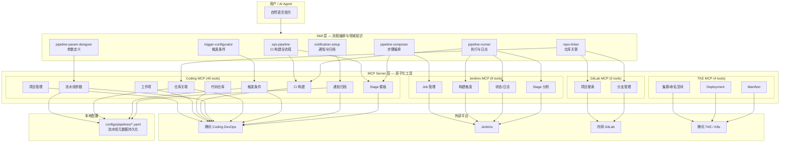
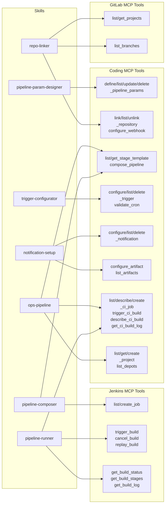
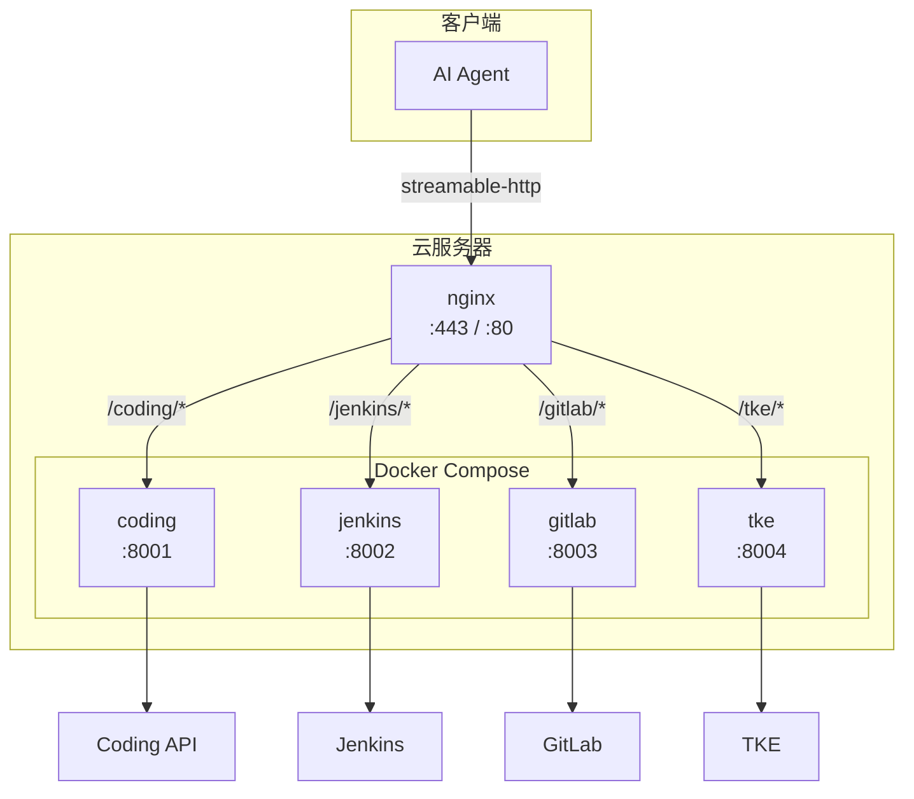

# ops-agent

运维自动化 Agent —— 接收业务上线需求，自动完成 CI/CD 流水线配置、构建部署、网络配置。

基于 [FastMCP](https://github.com/jlowin/fastmcp) 构建 MCP Server，通过标准化 Tool 接口对接 Coding DevOps、Jenkins、GitLab、TKE 等平台。

---

## 系统架构



---

## Skill — MCP 关系矩阵



**Skill 与 MCP 工具对照表：**

| Skill | 调用的 MCP Server | 主要 MCP Tools |
|-------|-------------------|---------------|
| `ops-pipeline` | Coding | `list_projects`, `list_depots`, `list_ci_jobs`, `get_or_create_ci_job`, `trigger_ci_build`, `get_ci_build_log` |
| `pipeline-param-designer` | Coding | `define_pipeline_params`, `list_pipeline_params`, `update_pipeline_param`, `delete_pipeline_param` |
| `repo-linker` | Coding + GitLab | `link_repository`, `list_linked_repos`, `configure_webhook`, `list_depots`, `gitlab.list_projects`, `gitlab.list_branches` |
| `pipeline-composer` | Coding + Jenkins | `list_stage_templates`, `get_stage_template`, `compose_pipeline`, `create_ci_job`, `jenkins.create_job` |
| `trigger-configurator` | Coding | `configure_trigger`, `list_triggers`, `delete_trigger`, `validate_cron_expression` |
| `notification-setup` | Coding | `configure_notification`, `list_notifications`, `configure_artifact`, `list_artifacts_config`, `list_ci_artifacts` |
| `pipeline-runner` | Coding + Jenkins | `trigger_ci_build`, `describe_ci_build`, `get_ci_build_log`, `jenkins.trigger_build`, `jenkins.get_build_status`, `jenkins.get_build_stages`, `jenkins.cancel_build`, `jenkins.replay_build` |

---

## MCP Tool 全量清单

### Coding MCP Server — 40 tools

| 类别 | Tool | 说明 |
|------|------|------|
| **项目管理** | `list_projects` | 查询项目列表（模糊搜索） |
| | `get_project` | 查询项目详情 |
| | `create_project` | 创建项目 |
| | `delete_project` | 删除项目 |
| **工作项** | `list_issues` | 查询工作项列表 |
| | `describe_issue` | 查询工作项详情 |
| | `create_issue` | 创建工作项 |
| | `delete_issue` | 删除工作项 |
| | `decompose_issue` | 需求拆解为子任务 |
| **代码仓库** | `list_depots` | 查询代码仓库列表 |
| | `list_commits` | 查询提交记录 |
| | `create_merge_request` | 创建合并请求 |
| **CI 构建** | `list_ci_jobs` | 查询构建计划列表 |
| | `describe_ci_job` | 获取构建计划详情 |
| | `create_ci_job` | 创建构建计划 |
| | `get_or_create_ci_job` | 幂等创建构建计划 |
| | `trigger_ci_build` | 触发构建 |
| | `list_ci_builds` | 获取构建历史记录 |
| | `describe_ci_build` | 查询构建详情 |
| | `get_ci_build_log` | 获取构建日志 |
| **流水线参数** | `define_pipeline_params` | 定义参数列表 |
| | `list_pipeline_params` | 查询参数列表 |
| | `update_pipeline_param` | 修改单个参数 |
| | `delete_pipeline_param` | 删除参数 |
| **仓库关联** | `link_repository` | 关联仓库到流水线 |
| | `list_linked_repos` | 查询已关联仓库 |
| | `unlink_repository` | 取消仓库关联 |
| | `configure_webhook` | 配置 Webhook 触发 |
| **构建模板** | `list_stage_templates` | 列出可用阶段模板 |
| | `get_stage_template` | 获取模板详情 |
| | `compose_pipeline` | 组合生成 Jenkinsfile |
| **触发条件** | `configure_trigger` | 配置触发规则 |
| | `list_triggers` | 查询触发规则 |
| | `delete_trigger` | 删除触发规则 |
| | `validate_cron_expression` | 校验 cron 表达式 |
| **通知与归档** | `configure_notification` | 配置通知规则 |
| | `list_notifications` | 查询通知规则 |
| | `delete_notification` | 删除通知规则 |
| | `configure_artifact` | 配置制品归档 |
| | `list_artifacts_config` | 查询归档配置 |
| | `list_ci_artifacts` | 查询制品列表 |

### Jenkins MCP Server — 9 tools

| Tool | 说明 |
|------|------|
| `list_jobs` | 列出所有 Job |
| `create_job` | 创建 Pipeline Job |
| `trigger_build` | 触发构建（支持参数） |
| `get_build_status` | 获取构建状态 |
| `get_last_build_number` | 获取最新构建编号 |
| `get_build_log` | 获取构建日志 |
| `cancel_build` | 中止运行中的构建 |
| `replay_build` | 以相同参数重跑构建 |
| `get_build_stages` | 获取各 Stage 状态与耗时 |

### GitLab MCP Server — 3 tools

| Tool | 说明 |
|------|------|
| `list_projects` | 搜索项目（模糊匹配） |
| `get_project` | 获取项目详情 |
| `list_branches` | 列出分支 |

### TKE MCP Server — 4 tools (TODO)

| Tool | 说明 |
|------|------|
| `list_clusters` | 列出 TKE 集群 |
| `list_namespaces` | 列出命名空间 |
| `get_deployments` | 获取 Deployment 列表 |
| `apply_manifest` | 应用 K8s Manifest |

---

## Skill 详解

Skill 是面向 Agent 的领域知识文件，定义了特定场景下的工作流程、决策逻辑和 MCP 工具调用顺序。每个 Skill 独立可用，也可组合形成端到端流水线。

### 完整流水线配置流程

```
repo-linker → pipeline-param-designer → pipeline-composer → trigger-configurator → notification-setup → ops-pipeline → pipeline-runner
   ①              ②                        ③                     ④                      ⑤                 ⑥              ⑦
 关联仓库       定义参数                 编排步骤               配置触发               通知归档          创建计划        执行构建
```

---

### ① repo-linker — 代码仓库关联

**触发词：** "关联仓库"、"配置 Git 地址"、"设置源码拉取"

**作用：** 将代码仓库关联到流水线，配置认证信息、分支策略和 Webhook 触发。

**工作流程：**
1. 选择仓库来源（Coding / GitLab / 外部 Git）
2. 配置认证方式（SSH Key / HTTPS Token / 平台内置凭据）
3. 设置分支策略（固定分支 / 正则匹配 / 全部分支）
4. 可选配置 Webhook（push / merge_request / tag_push）

**输出：**
```json
{
  "repo_url": "https://coding.example.com/team/project.git",
  "credential_id": "coding-deploy-key",
  "default_branch": "master",
  "auth_type": "coding_credential",
  "branch_strategy": "single",
  "webhook_enabled": true,
  "webhook_events": ["push"]
}
```

**依赖 MCP：** `link_repository`, `list_linked_repos`, `configure_webhook`, `list_depots`, `gitlab.list_projects`, `gitlab.list_branches`

---

### ② pipeline-param-designer — 流水线参数定义

**触发词：** "给流水线加参数"、"配置构建参数"、"参数化构建"

**作用：** 引导定义流水线构建参数（分支/版本号/环境/配置项），持久化到本地配置，并可生成 Jenkins `parameters {}` 块。

**支持的参数类型：**

| 类型 | Jenkins 对应 | 示例 |
|------|-------------|------|
| `string` | `string(name:...)` | `BRANCH=master` |
| `choice` | `choice(name:..., choices:[...])` | `ENV=[dev, staging, prod]` |
| `boolean` | `booleanParam(name:...)` | `SKIP_TESTS=false` |
| `password` | `password(name:...)` | `DB_PASSWORD` |
| `text` | `text(name:...)` | `DEPLOY_NOTES` |

**输出：**
```json
[
  {"name": "BRANCH", "type": "string", "default": "master", "required": true, "description": "构建分支"},
  {"name": "ENV", "type": "choice", "choices": ["dev", "prod"], "default": "dev", "required": true, "description": "部署环境"},
  {"name": "SKIP_TESTS", "type": "boolean", "default": false, "required": false, "description": "跳过测试"}
]
```

**依赖 MCP：** `define_pipeline_params`, `list_pipeline_params`, `update_pipeline_param`, `delete_pipeline_param`

---

### ③ pipeline-composer — 构建步骤编排

**触发词：** "编排构建步骤"、"创建 Pipeline"、"生成 Jenkinsfile"

**作用：** 从 11 个预定义 Stage 模板中选择组合，自动生成完整的 Jenkinsfile。

**可用模板：**

| 模板 | 语言 | 说明 |
|------|------|------|
| `maven-build` | Java | mvn clean package -DskipTests |
| `maven-test` | Java | mvn test + JUnit 报告 |
| `gradle-build` | Java | ./gradlew build -x test |
| `npm-build` | Node.js | npm ci + npm run build |
| `npm-test` | Node.js | npm test |
| `go-build` | Go | go build |
| `go-test` | Go | go test ./... -v |
| `docker-build-push` | 通用 | docker build + push |
| `sonar-scan` | 通用 | SonarQube 代码扫描 |
| `helm-deploy` | 通用 | Helm upgrade --install |
| `artifact-archive` | 通用 | 制品归档 |

**推荐组合：**
- Java CI: `maven-build → maven-test → docker-build-push`
- Node CI: `npm-build → npm-test → docker-build-push`
- 完整 CD: `*-build → *-test → docker-build-push → helm-deploy`

**依赖 MCP：** `list_stage_templates`, `get_stage_template`, `compose_pipeline`, `create_ci_job`, `jenkins.create_job`

---

### ④ trigger-configurator — 触发条件配置

**触发词：** "配置触发条件"、"设置定时构建"、"推送代码自动构建"

**作用：** 配置流水线的自动触发规则，支持 6 种触发类型。

| 类型 | 说明 | 需要提供 |
|------|------|---------|
| `cron` | 定时触发 | cron 表达式（如 `0 2 * * 1`） |
| `push` | 代码推送触发 | 分支模式 + 可选路径过滤 |
| `merge_request` | MR 触发 | 源/目标分支 |
| `tag_push` | 标签推送触发 | 标签匹配模式 |
| `manual` | 手动触发 | 无 |
| `api` | API/Webhook 触发 | 可选 Token |

**依赖 MCP：** `configure_trigger`, `list_triggers`, `delete_trigger`, `validate_cron_expression`

---

### ⑤ notification-setup — 通知与归档配置

**触发词：** "配置通知"、"构建失败发钉钉"、"配置制品归档"

**作用：** 配置构建结果通知（钉钉/企微/邮件/Slack）和制品归档策略。

**通知渠道：**

| 渠道 | 配置方式 | 触发条件 |
|------|---------|---------|
| 钉钉 | Webhook URL | success / failure / always / unstable |
| 企微 | Webhook URL | 同上 |
| 邮件 | SMTP (host/port/user/pass) | 同上 |
| Slack | Incoming Webhook URL | 同上 |

**制品归档配置：** 存储类型（cos/nexus/coding_artifact）、存储路径、版本标记规则、保留天数。

**依赖 MCP：** `configure_notification`, `list_notifications`, `delete_notification`, `configure_artifact`, `list_artifacts_config`, `list_ci_artifacts`

---

### ⑥ ops-pipeline — CI 构建全流程

**触发词：** "创建 CI 流水线"、"创建构建计划"、"给这个服务建 CI"

**作用：** CI 构建的端到端编排 — 从确认项目到触发构建的完整链路。这是最核心的 Skill，整合了其他 Skill 的配置产出。

**两条流程：**

| 流程 | 代码仓库 | CI 平台 | 步骤 |
|------|---------|---------|------|
| A | Coding 仓库 | Coding CI | 确认项目 → 获取凭据 → 生成 Jenkinsfile → 幂等创建 → 触发 |
| B | GitLab 仓库 | Jenkins | 确认项目 → 创建 Job → 触发构建 → 查看结果 |

**关键决策：**
- 凭据 ID 从同类已有计划获取，不猜测
- 无凭据时降级为保底版（仅编译验证，不推镜像）
- 使用 `get_or_create_ci_job` 幂等创建，避免重复

**依赖 MCP：** `list_projects`, `get_project`, `list_depots`, `list_ci_jobs`, `describe_ci_job`, `get_or_create_ci_job`, `trigger_ci_build`

---

### ⑦ pipeline-runner — 流水线执行与日志

**触发词：** "执行流水线"、"触发构建"、"查看构建状态"、"构建日志"

**作用：** 触发构建并跟踪全过程，输出执行结果汇总。构建失败时自动分析日志定位错误。

**能力：**
- 触发构建（支持参数化）
- 轮询状态直到完成
- 各 Stage 耗时分析
- 日志错误定位与修复建议
- 重跑失败构建 / 取消构建

**输出示例：**
```
构建结果:
  流水线: my-service-ci  #42
  状态: FAILURE  耗时: 3m 25s

  阶段耗时:
    检出    [SUCCESS]  5s
    构建    [FAILURE]  1m 32s  ← 失败点
    推镜像  [SKIPPED]  -

  错误摘要:
    [ERROR] Compilation failure: cannot find symbol...
```

**依赖 MCP：** `trigger_ci_build`, `describe_ci_build`, `get_ci_build_log`, `jenkins.trigger_build`, `jenkins.get_build_status`, `jenkins.get_build_stages`, `jenkins.get_build_log`, `jenkins.cancel_build`, `jenkins.replay_build`

---

## 项目结构

```
ops-agent/
├── mcp_servers/                  # MCP Server 实现
│   ├── __init__.py               # 共享启动逻辑（stdio / streamable-http）
│   ├── coding/
│   │   ├── server.py             # 40 个 MCP Tool 注册
│   │   ├── api.py                # Coding OpenAPI 客户端
│   │   ├── templates.py          # Jenkinsfile 模板（镜像构建）
│   │   ├── stage_templates.py    # 11 个 Stage 模板 + 组合生成器
│   │   └── pipeline_config.py    # 流水线元数据本地持久化 (YAML)
│   ├── jenkins/
│   │   ├── server.py             # 9 个 MCP Tool 注册
│   │   └── api.py                # Jenkins REST API 客户端
│   ├── gitlab/
│   │   ├── server.py             # 3 个 MCP Tool 注册
│   │   └── api.py                # GitLab REST API 客户端
│   └── tke/
│       └── server.py             # 4 个 MCP Tool（TODO）
├── skills/                       # Agent Skill 定义
│   ├── ops-pipeline/             # CI 构建全流程（含业务线规范）
│   │   ├── SKILL.md
│   │   └── references/           # 业务线差异化配置
│   ├── pipeline-param-designer/  # 参数定义引导
│   ├── repo-linker/              # 仓库关联引导
│   ├── pipeline-composer/        # 步骤编排引导
│   ├── trigger-configurator/     # 触发条件引导
│   ├── notification-setup/       # 通知归档引导
│   └── pipeline-runner/          # 执行与日志引导
├── configs/
│   ├── .env.example              # 环境变量模板
│   ├── mcp_registry.yaml         # MCP Server 注册表
│   ├── projects/                 # 项目配置
│   ├── env/                      # 环境配置 (dev/prod)
│   ├── pipelines/                # 流水线元数据（运行时生成）
│   └── manifests/                # K8s Manifest 模板
├── src/ops_agent/                # Agent 主逻辑
├── prompts/                      # Prompt 模板
├── tests/                        # 测试
├── docs/                         # 设计文档
├── Dockerfile                    # 容器镜像构建
├── docker-compose.yml            # 多服务编排
├── pyproject.toml                # 项目依赖
└── Makefile                      # 常用命令
```

---

## 快速开始

### 环境要求

- Python >= 3.11
- [uv](https://docs.astral.sh/uv/) 包管理器

### 安装

```bash
# 克隆项目
git clone git@github.com:NoahOno/ops-agent.git
cd ops-agent

# 安装依赖
make install

# 配置环境变量
cp configs/.env.example configs/.env
# 编辑 configs/.env 填入实际凭据
```

### 环境变量

| 变量 | 说明 | 必需 |
|------|------|------|
| `MCP_TRANSPORT` | 传输模式: `stdio` (本地) / `streamable-http` (远程) | 否，默认 stdio |
| `MCP_HOST` | HTTP 绑定地址 | 否，默认 0.0.0.0 |
| `MCP_PORT` | HTTP 绑定端口 | 否，默认 8000 |
| `MCP_STATELESS` | 无状态模式（推荐远程部署时开启） | 否，默认 false |
| `CODING_TOKEN` | Coding DevOps 访问令牌 | 是 |
| `CODING_TEAM` | Coding 团队名（用于拼接 API URL） | 是 |
| `JENKINS_URL` | Jenkins 服务地址 | Jenkins 流程需要 |
| `JENKINS_USER` | Jenkins 用户名 | Jenkins 流程需要 |
| `JENKINS_TOKEN` | Jenkins API Token | Jenkins 流程需要 |
| `GITLAB_URL` | 内网 GitLab 地址 | GitLab 流程需要 |
| `GITLAB_TOKEN` | GitLab Private Token | GitLab 流程需要 |
| `TKE_SECRET_ID` | 腾讯云 SecretId | TKE 流程需要 |
| `TKE_SECRET_KEY` | 腾讯云 SecretKey | TKE 流程需要 |
| `TKE_REGION` | TKE 区域（默认 ap-guangzhou） | TKE 流程需要 |

### 运行 MCP Server

```bash
# ── 本地模式 (stdio，开发机默认) ──
make run-coding
make run-jenkins
make run-gitlab
make run-tke

# ── 远程模式 (streamable-http，云服务器) ──
make run-coding-remote    # :8001
make run-jenkins-remote   # :8002
make run-gitlab-remote    # :8003
make run-tke-remote       # :8004

# ── 开发模式（带 Inspector） ──
make dev-coding
make dev-jenkins
make dev-gitlab
```

### 链接 Skill

```bash
# 将项目内 skill 链接到 ~/.qoder/skills
make link-skills
```

---

## 流水线配置流程

一个完整的流水线创建流程涉及多个 Skill 协作：

```
1. repo-linker          → 关联代码仓库
2. pipeline-param-designer → 定义构建参数
3. pipeline-composer    → 编排构建步骤，生成 Jenkinsfile
4. trigger-configurator → 配置触发条件
5. notification-setup   → 配置通知和归档
6. ops-pipeline         → 创建构建计划（幂等）
7. pipeline-runner      → 触发构建，查看结果
```

每个 Skill 独立可用，也可组合形成端到端流水线配置。

---

## 开发

```bash
# 安装开发依赖
make dev

# 代码检查
make lint

# 运行测试
make test
```

### 新增 MCP Tool

1. 在对应 `mcp_servers/{server}/api.py` 中添加 API 方法
2. 在 `mcp_servers/{server}/server.py` 中用 `@mcp.tool()` 注册
3. 更新 `configs/mcp_registry.yaml` 注册 tool 名称
4. 如需本地持久化，使用 `pipeline_config.py` 模块

### 新增 Skill

1. 创建 `skills/{skill-name}/SKILL.md`
2. 编写 frontmatter（name + description）和执行流程
3. 列出依赖的 MCP Tools
4. 运行 `make link-skills` 链接到本地

---

## 云部署

### 部署架构



### Docker Compose 部署

```bash
# 1. 配置环境变量
cp configs/.env.example .env
# 编辑 .env 填入实际凭据

# 2. 构建并启动所有服务
make docker-build
make docker-up

# 3. 验证服务
curl http://localhost:8001/mcp -X POST -H "Content-Type: application/json" \
  -d '{"jsonrpc":"2.0","method":"initialize","id":1,"params":{"protocolVersion":"2025-03-26","capabilities":{},"clientInfo":{"name":"test","version":"0.1"}}}'

# 4. 停止服务
make docker-down
```

### 端口分配

| Server | 端口 | 端点 |
|--------|------|------|
| Coding MCP | 8001 | `/mcp` |
| Jenkins MCP | 8002 | `/mcp` |
| GitLab MCP | 8003 | `/mcp` |
| TKE MCP | 8004 | `/mcp` |

### Nginx 反向代理（可选）

统一入口，适合对外暴露：

```nginx
upstream coding_mcp { server 127.0.0.1:8001; }
upstream jenkins_mcp { server 127.0.0.1:8002; }
upstream gitlab_mcp { server 127.0.0.1:8003; }
upstream tke_mcp    { server 127.0.0.1:8004; }

server {
    listen 443 ssl;
    server_name mcp.example.com;

    location /coding/ { proxy_pass http://coding_mcp/; }
    location /jenkins/ { proxy_pass http://jenkins_mcp/; }
    location /gitlab/ { proxy_pass http://gitlab_mcp/; }
    location /tke/    { proxy_pass http://tke_mcp/; }
}
```

### 客户端连接配置

远程模式下，MCP 客户端配置示例：

```json
{
  "mcpServers": {
    "coding": {
      "url": "http://your-server:8001/mcp",
      "transport": "streamable-http"
    },
    "jenkins": {
      "url": "http://your-server:8002/mcp",
      "transport": "streamable-http"
    }
  }
}
```

---

## License

Internal use only.
